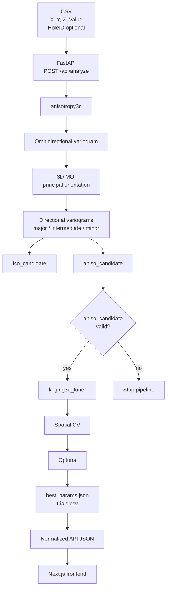

# ГОРИЗОНТ

**ГОРИЗОНТ** — веб-приложение для автоматизированного анализа пространственной структуры 3D-геологических данных и подбора параметров поискового соседства для **Ordinary Kriging**.

Текущая версия решает две связанные задачи:

1. оценивает пространственную анизотропию и вариограммный эллипсоид по точечным данным;
2. автоматически подбирает параметры поискового эллипсоида Ordinary Kriging по пространственной кросс-валидации.

Проект намеренно разделён на независимые вычислительные модули:

- `anisotropy3d` — анализ пространственной непрерывности;
- `kriging3d_tuner` — Ordinary Kriging и оптимизация поискового соседства;
- `pipeline3d` — оркестрация двух стадий;
- `api` — тонкий HTTP-слой;
- Next.js frontend — загрузка данных и отображение результатов.

Математика модулей `anisotropy3d` и `kriging3d_tuner` изолирована от веб-приложения: API не дублирует и не переписывает вычислительное ядро.

---

## 1. Общая архитектура



Вычислительный путь:

```text
CSV
  ↓
anisotropy3d
  ↓
result.json
  ↓
aniso_candidate
  ↓
kriging3d_tuner
  ↓
best_params.json + trials.csv
  ↓
FastAPI
  ↓
Frontend
```

Важно: текущий pipeline **не сравнивает ISO и ANISO модели между собой**.  
`iso_candidate` сохраняется для диагностики и будущего развития, но текущий `pipeline3d` передаёт в tuner именно `aniso_candidate`.

---

# 2. Входные данные

Для веб-приложения CSV должен содержать обязательные колонки:

| Поле | Назначение |
|---|---|
| `X` | координата X |
| `Y` | координата Y |
| `Z` | координата Z |
| `Value` | моделируемый показатель |
| `HoleID` | необязательно; идентификатор скважины |

Пример:

```csv
X,Y,Z,Value,HoleID
102.5,204.1,53.2,1.34,BH001
103.1,204.8,51.7,1.51,BH001
118.6,217.3,49.4,0.92,BH002
```

Для web/API-пути имена `X`, `Y`, `Z`, `Value` должны присутствовать именно в таком виде.

Минимальное число валидных точек по умолчанию:

```yaml
n_min_points: 30
```

Строки с нечисловыми или неfinite значениями координат/`Value` исключаются вычислительным ядром.

Совпадающие координаты в `anisotropy3d` объединяются с усреднением `Value`.

---

# 3. Стадия I — `anisotropy3d`

Назначение модуля — определить геометрию пространственной непрерывности:

```text
данные
  ↓
валидация
  ↓
pair cloud
  ↓
omnidirectional variogram
  ↓
3D MOI orientation
  ↓
directional variograms
  ↓
variogram ellipsoid
```

Главный результат стадии — параметры вариограммной модели и её ориентация:

```text
nugget
sill
range_major
range_intermediate
range_minor
orientation_matrix
```

`orientation_matrix` — основной источник информации об ориентации.

Азимуты и падения являются только производным представлением для отчёта.

---

## 3.1 Проверка геометрии данных

Перед анализом проверяются:

- количество валидных точек;
- дисперсия `Value`;
- совпадающие координаты;
- пространственная размерность облака.

Размерность оценивается через PCA координат.

Если данные фактически расположены почти на линии или почти в одной плоскости, полноценная 3D-анизотропия считается недоопределённой.

В таком случае standalone-анализ возвращает техническую сферическую модель с причиной:

```text
3D anisotropy underdetermined due to spatial dimensionality
```

Это технический fallback и **не является утверждением о физической изотропности месторождения**.

---

# 4. Формирование пар точек

Для двух точек $i,j$:

$$
\Delta\mathbf{x}_{ij}
=
\mathbf{x}_j-\mathbf{x}_i
$$

$$
h_{ij}
=
\|\Delta\mathbf{x}_{ij}\|
$$

Экспериментальная полувариация пары:

$$
\gamma_{ij}
=
\frac{1}{2}(z_j-z_i)^2
$$

Также сохраняется единичный вектор направления:

$$
\mathbf{u}_{ij}
=
\frac{\Delta\mathbf{x}_{ij}}{h_{ij}}
$$

---

## 4.1 Ограничение расстояния

`max_dist` определяется один раз при создании pair cloud и затем используется всеми последующими расчётами.

По умолчанию:

```yaml
pairs:
  max_dist: null
  max_dist_percentile: 50.0
```

То есть при отсутствии явного `max_dist` используется 50-й процентиль распределения межточечных расстояний.

Omnidirectional и directional variograms используют уже сформированное облако пар и повторно расстояния не обрезают.

---

## 4.2 Sampling пар

Число всех пар растёт как:

$$
N_{pairs}=\frac{n(n-1)}{2}
$$

Поэтому для больших наборов данных ядро не обязано материализовывать все $O(n^2)$ пары.

По умолчанию:

```yaml
max_pairs: 200000
seed: 42
```

Если пар больше лимита, выполняется детерминированная случайная выборка уникальных пар.

В диагностику записываются:

```text
total_possible_pairs
used_pairs
pair_sampling_applied
pair_sampling_fraction
max_dist
```

---

# 5. Omnidirectional variogram

После формирования pair cloud рассчитывается всенаправленная экспериментальная вариограмма.

Текущая модель:

```text
spherical
```

Используются 12 lag-интервалов:

```yaml
variogram:
  model: spherical
  n_lags: 12
  min_pairs_per_lag: 8
```

Модель имеет вид:

$$
\gamma(h)
=
n_0
+
c
\left[
\frac{3}{2}\frac{h}{a}
-
\frac{1}{2}
\left(\frac{h}{a}\right)^3
\right],
\qquad 0<h<a
$$

и

$$
\gamma(h)=n_0+c,
\qquad h\ge a
$$

где:

- $n_0$ — nugget;
- $c$ — partial sill;
- $a$ — range.

Подгонка выполняется с весами по количеству пар в lag:

$$
w_k=n_{pairs,k}
$$

Минимизируется взвешенная сумма квадратов ошибок.

На omnidirectional стадии свободно оцениваются:

```text
nugget
partial sill
range
```

Именно полученные `nugget` и `sill` далее фиксируются при определении directional ranges.

---

# 6. Определение ориентации: 3D MOI

Основной detector текущей версии:

```yaml
detector:
  mode: moi3d
```

Старый `legacy_range_ellipsoid` оставлен в коде для A/B и диагностических экспериментов, но не является основным режимом.

Принцип текущего алгоритма:

```text
directional experimental variograms
            ↓
standardized radial covariance
            ↓
3D moment-of-inertia tensor
            ↓
eigenvectors
            ↓
principal continuity directions
```

---

## 6.1 Направления

Используется равномерная система направлений на полусфере Fibonacci:

```yaml
n_directions: 96
angular_tolerance_deg: 22.5
```

Для каждого направления строится directional experimental variogram.

---

## 6.2 Radial covariance representation

Для каждой валидной точки directional variogram вычисляется стандартизованная covariance-like величина:

$$
C =
\operatorname{clip}
\left(
1-\frac{\gamma(h)}{n_0+c},
0,
1
\right)
$$

Для расчёта MOI используется масса:

$$
m =
\frac{C}{h^p}
$$

где в текущем конфиге:

$$
p=2.5
$$

---

## 6.3 Lag window

При MOI не используются самые ближние и самые дальние lag-интервалы.

Текущий диапазон:

```yaml
lag_frac_of_max_dist_min: 0.2
lag_frac_of_max_dist_max: 0.9
```

то есть:

$$
0.2\,h_{max}
\le h \le
0.9\,h_{max}
$$

Это уменьшает чрезмерное влияние ближней к началу части covariance field и нестабильной крайней части вариограммы.

---

# 7. MOI tensor

Каждый covariance sample рассматривается как точка:

$$
\mathbf{r} = h\mathbf{u}
$$

В inertia tensor добавляется:

$$
I
\mathrel{+}=
m
\left(
h^2I_3-\mathbf{r}\mathbf{r}^T
\right)
$$

После этого выполняется eigen decomposition:

$$
I\mathbf{q}_k
=
\lambda_k\mathbf{q}_k
$$

Собственные значения сортируются по возрастанию.

Интерпретация:

```text
smallest eigenvalue  → major continuity direction
middle eigenvalue    → intermediate direction
largest eigenvalue   → minor continuity direction
```

Полученные векторы образуют матрицу:

$$
Q=
[
\mathbf{q}_{major},
\mathbf{q}_{intermediate},
\mathbf{q}_{minor}
]
$$

Она используется как `orientation_matrix`.

Оси приводятся к устойчивому знаку и правой системе координат.

---

# 8. Directional ranges по главным осям

После определения ориентации MOI строятся три directional variogram:

```text
major
intermediate
minor
```

На этой стадии:

```text
nugget = fixed
sill   = fixed
range  = fitted
```

То есть nugget и partial sill берутся из omnidirectional модели, а для каждой главной оси отдельно подбирается только range.

Текущие параметры:

```yaml
refinement:
  n_lags: 16
  angular_tolerance_deg: 18.0
```

После подгонки ranges и соответствующие им оси сортируются **связано**, чтобы выполнялось:

$$
a_{major}
\ge
a_{intermediate}
\ge
a_{minor}
$$

Нельзя сортировать ranges отдельно от orientation vectors.

---

# 9. `iso_candidate` и `aniso_candidate`

Это важная архитектурная особенность текущей версии.

`anisotropy3d` формирует два концептуально разных кандидата.

### ISO candidate

```text
range_major = omni_range
range_intermediate = omni_range
range_minor = omni_range
orientation_matrix = Identity
```

### ANISO candidate

Содержит:

```text
orientation_matrix
major_axis_xyz
intermediate_axis_xyz
minor_axis_xyz

range_major
range_intermediate
range_minor

nugget
sill
variogram_model

directional_fits
moi_strength
moi_eigenvalues
```

`aniso_candidate` сохраняется, если MOI orientation получена и три directional range технически удалось оценить.

---

# 10. Standalone ISO/ANISO verdict

MOI **не используется как абсолютный статистический тест существования анизотропии**.

Он используется прежде всего как способ получить candidate orientation.

Standalone `anisotropy3d` дополнительно применяет консервативные gates.

Текущие пороги:

```yaml
moi:
  isotropy_ratio_max: 1.30

classification:
  ratio_iso_max: 1.30
  ratio_equal_max: 1.30
```

Standalone ANISO принимается только при достаточном MOI contrast и согласованности directional ranges.

Если gates не пройдены, top-level результат может быть:

```text
type = ISOTROPIC
```

при этом технически валидный:

```text
aniso_candidate
```

может продолжать присутствовать в `result.json`.

Это намеренное разделение:

```text
MOI / standalone verdict
        ≠
окончательный выбор лучшей predictive model
```

В будущем ISO и ANISO candidates могут сравниваться через spatial CV.

---

# 11. Confidence и fallback

`anisotropy3d` формирует:

```text
confidence = HIGH | MEDIUM | LOW
confidence_reasons
fallback_reason
```

Причинами снижения уверенности могут быть:

- недостаточная пространственная размерность;
- недостаток directional support;
- плохое покрытие направлений;
- высокий nugget fraction;
- нестабильность оценки.

Высокий:

```text
nugget / (nugget + sill)
```

**не приводит автоматически к ISO**.

Он используется как диагностический признак шума и снижает confidence.

При невозможности устойчиво определить 3D geometry standalone-модель может перейти к безопасной сфере.

---

# 12. Что передаётся в `kriging3d_tuner`

Текущий `pipeline3d` после завершения `anisotropy3d` открывает:

```text
anisotropy/result.json
```

и требует наличие валидного:

```text
aniso_candidate
```

Обязательные поля:

```text
variogram_model
nugget
sill
range_major
range_intermediate
range_minor
orientation_matrix
```

Если candidate отсутствует или неполон:

```text
kriging3d_tuner НЕ запускается
```

Если candidate валиден, весь `result.json` передаётся в tuner.

Tuner при загрузке JSON отдаёт приоритет именно:

```text
aniso_candidate
```

а не top-level standalone verdict.

Поэтому возможна ситуация:

```text
standalone type = ISOTROPIC
aniso_candidate = available
```

и текущий pipeline всё равно выполняет ANISO Ordinary Kriging tuning.

Это соответствует текущей архитектуре.

`iso_candidate` пока не участвует в CV-сравнении.

---

# 13. Стадия II — `kriging3d_tuner`

Вторая стадия получает **фиксированный вариограммный эллипсоид**.

В течение Optuna study НЕ изменяются:

```text
variogram_model
nugget
sill

range_major
range_intermediate
range_minor

orientation_matrix
```

Оптимизируется только **search neighbourhood** Ordinary Kriging.

Это принципиальное разделение:

```text
VARIOGRAM ELLIPSOID
        ≠
SEARCH ELLIPSOID
```

Variogram ranges описывают spatial continuity.

Search radii определяют, какие наблюдения разрешено использовать при конкретном прогнозе.

---

# 14. Система координат

Пусть:

$$
Q=
[
q_{major},
q_{intermediate},
q_{minor}
]
$$

Для пространственного лага:

$$
\Delta x
$$

локальные координаты:

$$
x'
=
Q^T\Delta x
$$

То есть все вычисления search и variogram geometry выполняются в общей principal-axis системе.

---

# 15. Variogram ellipsoid

Variogram distance:

$$
h'
=
\sqrt{
\left(
\frac{x'}{a_{major}}
\right)^2
+
\left(
\frac{y'}{a_{intermediate}}
\right)^2
+
\left(
\frac{z'}{a_{minor}}
\right)^2
}
$$

где:

```text
a_major
a_intermediate
a_minor
```

— ranges, полученные `anisotropy3d`.

Эти параметры во время Optuna не меняются.

---

# 16. Search ellipsoid

Search neighbourhood имеет ту же ориентацию $Q$, но собственные semi-axes:

$$
R_{major},
R_{inter},
R_{minor}
$$

Точка допускается в соседство только если:

$$
\left(
\frac{x'}{R_{major}}
\right)^2
+
\left(
\frac{y'}{R_{inter}}
\right)^2
+
\left(
\frac{z'}{R_{minor}}
\right)^2
\le 1
$$

Это **hard search ellipsoid**.

Никаких соседей за пределами эллипсоида алгоритм не добавляет.

---

# 17. Параметризация search ellipsoid

Optuna напрямую подбирает:

```text
R_major
K_inter
K_minor
Nmin
Nmax
```

Второй и третий радиусы вычисляются:

$$
R_{inter}
=
R_{major}K_{inter}
$$

$$
R_{minor}
=
R_{major}K_{minor}
$$

Ограничения:

$$
1
\ge
K_{inter}
\ge
K_{minor}
>
0
$$

и:

$$
N_{min}
\le
N_{max}
$$

Таким образом, порядок осей не ломается во время оптимизации.

---

# 18. Текущий search space

По умолчанию:

```yaml
search_space:
  r_lo: 0.5
  r_hi: 3.0

  k_min: 0.05

  nmin_lo: 4
  nmin_hi: 12

  nmax_lo: 8
  nmax_hi: 64
```

Для major search radius:

$$
R_{major}
\in
[
0.5a_{major},
3.0a_{major}
]
$$

Это **search space Optuna**, а не утверждение о том, что оптимальный search radius равен variogram range.

---

# 19. Выбор соседей

Для каждой prediction point:

1. все training samples переводятся в principal coordinates;
2. рассчитывается normalized search distance;
3. остаются только точки внутри hard ellipsoid;
4. если их больше `Nmax`, выбираются ближайшие по anisotropic search distance;
5. если их меньше `Nmin`, prediction считается невалидным.

То есть:

```text
count < Nmin
    ↓
prediction = NaN
```

Нет:

```text
outside-neighbour fallback
automatic radius expansion
Euclidean nearest-neighbour rescue
```

Это позволяет coverage действительно отражать способность выбранного search neighbourhood покрывать пространство.

---

# 20. Ordinary Kriging

После выбора соседей строится система Ordinary Kriging:

$$
\begin{bmatrix}
K & \mathbf{1} \\
\mathbf{1}^T & 0
\end{bmatrix}
\begin{bmatrix}
\lambda\\
\mu
\end{bmatrix}
=
\begin{bmatrix}
k\\
1
\end{bmatrix}
$$

Для covariance используется spherical variogram geometry.

`Sill` здесь — partial sill.

Для разных точек:

$$
K_{ij}
=
C(h'_{ij})
$$

На диагонали:

$$
K_{ii}
=
sill+nugget
$$

Target-data covariance не получает дополнительный nugget.

Основное решение выполняется через:

```python
numpy.linalg.solve
```

При singular system используется:

```python
numpy.linalg.lstsq
```

Оценка:

$$
\hat z
=
\sum_i\lambda_i z_i
$$

---

# 21. Пространственная кросс-валидация

Все Optuna trials используют **один и тот же заранее построенный набор folds**.

Это исключает изменение CV-разбиения между trials.

---

## 21.1 Если присутствует `HoleID`

Используется:

```text
GroupKFold
```

По умолчанию:

```yaml
n_splits: 5
```

Все точки одной скважины находятся только в train или только в test.

Если число скважин меньше пяти:

```text
n_splits = number of unique HoleID
```

Минимально требуется две уникальные скважины.

---

## 21.2 Если `HoleID` отсутствует

Используется spatial block CV в 3D.

Bounding box разбивается на:

```yaml
grid_nx: 3
grid_ny: 3
grid_nz: 2
```

то есть максимум:

$$
3\times3\times2=18
$$

пространственных блоков.

Каждый непустой блок один раз становится test-set.

---

# 22. Метрики CV

Метрики считаются **pooled по всем OOF predictions**, а не как среднее RMSE отдельных folds.

Пусть:

```text
n_tgt   = все validation targets
n_valid = targets с finite prediction
```

Coverage:

$$
coverage
=
\frac{n_{valid}}{n_{tgt}}
$$

RMSE:

$$
RMSE
=
\sqrt{
\frac{1}{n_{valid}}
\sum
(\hat z-z)^2
}
$$

MAE:

$$
MAE
=
\frac{1}{n_{valid}}
\sum
|\hat z-z|
$$

RMSE и MAE вычисляются только для valid predictions.

Поэтому coverage обязательно используется совместно с ошибкой.

---

# 23. Objective Optuna

Текущий минимальный допустимый coverage:

```yaml
coverage_min: 0.97
```

Objective:

$$
Objective
=
CV\_RMSE
+
P
\max(
0,\;
0.97-coverage
)
$$

где:

```yaml
coverage_penalty: 1.0e6
```

Таким образом, решение с маленьким RMSE, которое способно оценить только небольшую часть validation points, не может искусственно выиграть оптимизацию.

Если валидных predictions нет вообще, используется большой конечный fallback objective.

---

# 24. Optuna

Используется:

```text
TPESampler
```

По умолчанию:

```yaml
seed: 42

optuna:
  n_trials: 200
  n_ei_candidates: 64
  flush_every: 25
```

Если `n_startup_trials` не задан:

```text
max(10, 30% от n_trials)
```

Во время study для каждого trial сохраняются:

```text
R_major
R_inter
R_minor
K_inter
K_minor
Nmin
Nmax

CV_RMSE
CV_MAE
prediction_coverage

n_valid
n_invalid
n_tgt

objective
```

Лучший trial определяется по минимальному penalized objective.

При этом в итоговый `best_params.json` отдельно записываются реальные unpenalized:

```text
CV_RMSE
CV_MAE
prediction_coverage
```

---

# 25. Результат `kriging3d_tuner`

Основной файл:

```text
best_params.json
```

содержит:

```json
{
  "R_major": 0.0,
  "R_inter": 0.0,
  "R_minor": 0.0,

  "K_inter": 0.0,
  "K_minor": 0.0,

  "Nmin": 0,
  "Nmax": 0,

  "CV_RMSE": 0.0,
  "CV_MAE": 0.0,
  "prediction_coverage": 0.0,

  "objective": 0.0,
  "best_trial_number": 0
}
```

Также сохраняются:

```text
variogram_fixed
search_space
CV method
number of folds
seed
runtime_seconds
```

---

# 26. Структура одного run

Каждый запуск получает уникальный:

```text
run_id
```

Артефакты сохраняются независимо:

```text
runs/<run_id>/
│
├── input.csv
│
├── pipeline_summary.json
│
├── anisotropy/
│   ├── result.json
│   ├── directional_scan.csv
│   ├── moi_radial_samples.csv
│   ├── omnidirectional_variogram.png
│   ├── principal_axes.png
│   ├── major_variogram.png
│   ├── intermediate_variogram.png
│   └── minor_variogram.png
│
└── kriging_tuning/
    ├── _run_config.yaml
    ├── best_params.json
    └── trials.csv
```

Такая структура намеренно сохраняет исходные вычислительные артефакты.

В дальнейшем из них можно формировать расширенный HTML/PDF-отчёт без изменения математического ядра.

---

# 27. `pipeline3d`

`pipeline3d` — только orchestration layer.

Он не содержит собственной геостатистической математики.

Его ответственность:

```text
проверить входные пути
        ↓
запустить anisotropy3d
        ↓
проверить result.json
        ↓
валидировать aniso_candidate
        ↓
запустить kriging3d_tuner
        ↓
создать pipeline_summary.json
```

Если первая стадия завершилась некорректно, вторая не запускается.

---

# 28. API

FastAPI является тонким adapter поверх `pipeline3d`.

## Healthcheck

```http
GET /api/health
```

Ответ:

```json
{
  "status": "ok"
}
```

## Анализ

```http
POST /api/analyze
```

`multipart/form-data`:

```text
file   — CSV
trials — optional
```

Если `trials` не указан, используется значение из:

```text
kriging3d_tuner/config.yaml
```

---

# 29. API workflow

После загрузки файла API:

```text
получает CSV
    ↓
проверяет обязательные колонки
    ↓
генерирует UUID run_id
    ↓
сохраняет input.csv
    ↓
запускает pipeline3d
    ↓
читает result.json
    ↓
читает best_params.json
    ↓
формирует нормализованный JSON
    ↓
возвращает результат frontend
```

Frontend не зависит от внутреннего формата всех диагностических файлов.

---

# 30. Основной API response

Упрощённо:

```json
{
  "run_id": "...",
  "status": "completed",

  "input": {
    "n_points": 420,
    "has_hole_id": true
  },

  "anisotropy": {
    "type": "TRIAXIAL",
    "variogram_model": "spherical",

    "nugget": 0.1,
    "sill": 1.0,

    "range_major": 100.0,
    "range_intermediate": 50.0,
    "range_minor": 25.0,

    "orientation_matrix": [],
    "major_axis_xyz": [],
    "intermediate_axis_xyz": [],
    "minor_axis_xyz": [],

    "moi_strength": 0.0
  },

  "optimization": {
    "R_major": 0.0,
    "R_inter": 0.0,
    "R_minor": 0.0,

    "K_inter": 0.0,
    "K_minor": 0.0,

    "Nmin": 0,
    "Nmax": 0,

    "CV_RMSE": 0.0,
    "CV_MAE": 0.0,
    "prediction_coverage": 0.0,

    "best_trial_number": 0
  }
}
```

API берёт orientation и principal axes именно из `aniso_candidate`, то есть из той модели, которая фактически была передана в tuner.

---

# 31. Frontend

Frontend реализован на Next.js.

Пользовательский поток:

```text
загрузить CSV
    ↓
Запустить анализ
    ↓
POST /api/analyze
    ↓
получить результат
    ↓
Анизотропия
Оптимизация
Валидация
```

Сейчас отображаются основные параметры:

### Анизотропия

```text
Major range
Intermediate range
Minor range
Nugget
Sill
Variogram model
```

### Оптимизация

```text
R major
R intermediate
R minor
Nmin
Nmax
```

### Валидация

```text
CV RMSE
CV MAE
Coverage
```

Текущий progress indicator frontend является UI-индикатором и не представляет собой server-side streaming отдельных стадий.

---

# 32. Локальный запуск backend

```bash
cd backend

pip install -e ./anisotropy3d
pip install -e ./kriging3d_tuner
pip install -e .
pip install fastapi uvicorn python-multipart

uvicorn api.app:app \
  --host 0.0.0.0 \
  --port 8000
```

Healthcheck:

```bash
curl http://localhost:8000/health
```

---

# 33. Запуск pipeline без API

```bash
cd backend

python -m pipeline3d \
  --data data.csv \
  --aniso-config anisotropy3d/config.yaml \
  --tuner-config kriging3d_tuner/config.yaml \
  --out-dir runs/test01 \
  --trials 200
```

Это позволяет тестировать математическое ядро независимо от сайта.

---

# 34. Docker

Из корня проекта:

```bash
docker compose up -d --build
```

Сервисы:

```text
gorizo-web — Next.js
gorizo-api — FastAPI + computational core
```

API container устанавливает непосредственно:

```text
anisotropy3d
kriging3d_tuner
pipeline3d
```

и запускает:

```text
uvicorn api.app:app
```

Каталог:

```text
./runs
```

монтируется в:

```text
/app/runs
```

и не должен коммититься в Git.

Текущий production compose использует внешнюю Docker network:

```text
georisk-pro_pro
```

---

# 35. Что система делает сейчас

Текущая версия предназначена для:

```text
prepared point/composite data
        ↓
3D spatial continuity analysis
        ↓
variogram anisotropy candidate
        ↓
search neighbourhood optimization
        ↓
spatial CV metrics
        ↓
recommended OK search parameters
```

То есть ГОРИЗОНТ автоматизирует конкретное звено пространственной оценки между подготовленными геологическими данными и дальнейшим использованием параметров оценки в геолого-горной информационной системе.

---

# 36. Что система пока НЕ делает

В текущей версии отсутствуют:

```text
DomainID loop
ISO vs ANISO CV model selection
автоматическое построение геологических доменов
wireframing
compositing
final block-model estimation
resource/reserve calculation
SGS
IDW optimization
PDF report export
авторизация пользователей
database storage
distributed task queue
```

`DomainID` не используется в вычислительном pipeline текущей версии.

Kriging tuner выполняет CV-оценку параметров, а не полный расчёт пользовательской prediction grid или промышленной блочной модели.

---

# 37. Главные архитектурные принципы

```text
1. Геологическая структура и search neighbourhood — разные задачи.

2. Variogram ellipsoid не равен search ellipsoid.

3. Orientation хранится полной 3×3 матрицей.

4. Ranges и orientation axes всегда связаны.

5. Search ellipsoid является жёстким.

6. Нет скрытого добора соседей за пределами search ellipsoid.

7. Пространственная CV используется вместо случайного разбиения.

8. RMSE рассчитывается pooled по OOF predictions.

9. Coverage является частью objective.

10. Variogram parameters не оптимизируются одновременно с search parameters.

11. MOI используется как estimator orientation, а не как абсолютный тест анизотропии.

12. Вычислительное ядро отделено от API и frontend.
```

---

# 38. Текущее состояние проекта

Версия `v0` является исследовательским/инженерным ядром для:

**3D anisotropy estimation + ANISO Ordinary Kriging search-neighbourhood optimization.**

Следующие логичные этапы развития:

```text
ISO vs ANISO CV comparison
        ↓
DomainID processing
        ↓
расширенный web-report
        ↓
визуализация 3D ellipsoid
        ↓
variogram diagnostics в UI
        ↓
экспорт отчёта
        ↓
интеграции с ГГИС
```

При развитии продукта вычислительные модули должны оставаться независимыми от presentation layer.